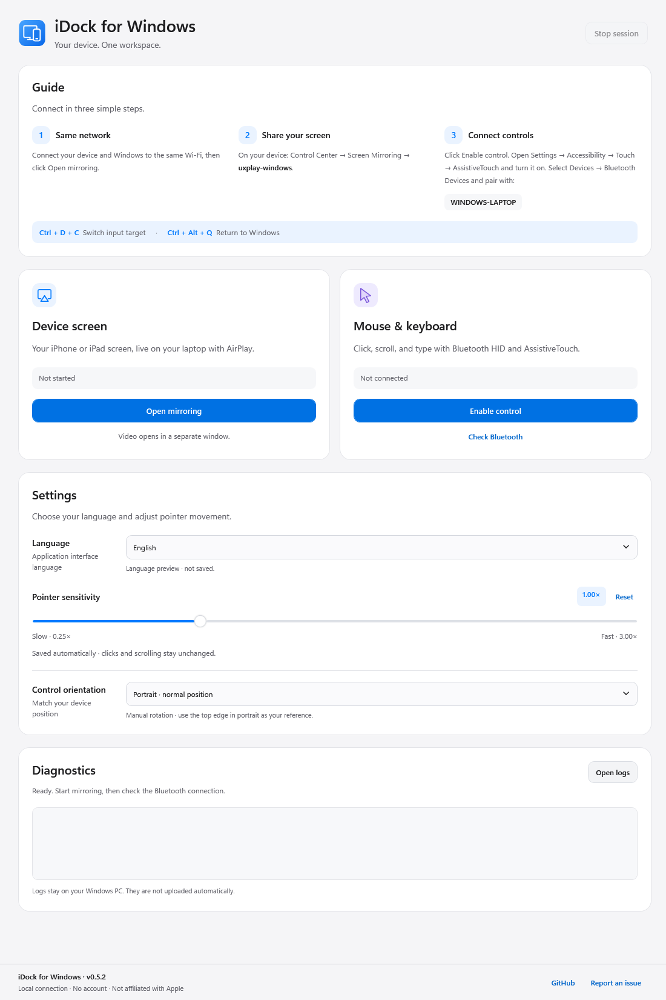

# iDock for Windows

[Bahasa Indonesia](README.md) · English

Mirror your iPhone or iPad on Windows, then interact with it using your laptop's mouse and keyboard. iDock keeps **AirPlay screen mirroring** separate from **Bluetooth LE HID control**, so you can use them together or independently.

[Download from GitHub Releases](https://github.com/samuelraindrwn/iphone-dock-windows/releases/latest) · [Installation](docs/en/INSTALL.md) · [User guide](docs/en/USAGE.md) · [Developer guide](docs/en/DEVELOPMENT.md)



*English interface preview, not a live connection indicator. Choose your language in Settings → Language.*

## Getting started

### 1. Install the app

Open [GitHub Releases](https://github.com/samuelraindrwn/iphone-dock-windows/releases/latest) and download the **`iDock-Setup-<version>-win-x64.exe`** file under **Assets** for an available release. Do not download **Source code** unless you intend to build the app. If the version you need has not been published, wait for its release or use the optional [developer build instructions](docs/en/DEVELOPMENT.md). A download link is not confirmation that a release has been published.

Run the installer, review the Windows permission prompts, and open **iDock for Windows** from the Start Menu. The Windows x64 installer includes the application runtime: **you do not need Git, an SDK, or a separate .NET installation**. A portable package is also an option.

The installer is not digitally signed. Check the download source, version, and checksum before running it; do not disable SmartScreen, antivirus, or Windows Firewall. See [download verification](docs/en/INSTALL.md).

By default, the receiver's firewall permissions cover **Private networks / LocalSubnet** only. Starting with 0.5.1, Setup offers an additional **Public Wi-Fi** option, unchecked on fresh installs. Read the [network permission scope](docs/en/INSTALL.md) before enabling it: the permission applies to all Public Wi-Fi networks, not just the network used during installation. Setup does not change network profiles, Bonjour, or Bluetooth.

### 2. Mirror your device

1. Connect Windows and your iPhone/iPad to the same local network.
2. Read **Guide (Panduan)** at the top of iDock, then click **Open mirroring (Buka mirroring)** in **Device screen (Layar perangkat)**. On first use, UxPlay may request Bonjour installation through an Administrator prompt. Review that prompt; if the receiver exits after installation, click **Open mirroring** again.
3. On your device, choose **Control Center → Screen Mirroring → uxplay-windows**. The screen appears in a separate video window.

If Windows asks for firewall permission, allow only the correct component on the trusted network you intend to use. Do not turn off the firewall.

Seeing the receiver name does not prove the video connection is working. If the name appears but connection fails, follow the [mirroring troubleshooting guide](docs/en/TROUBLESHOOTING.md#receiver-not-found-or-video-not-connecting).

### 3. Enable mouse and keyboard control

1. Turn on Bluetooth on Windows and your device, then click **Enable control (Aktifkan kontrol)** in **Mouse & keyboard**.
2. In the device's **Settings** app, open **Accessibility → Touch → AssistiveTouch** and enable it. Select **Devices → Bluetooth Devices** and pair with the laptop name shown in iDock's **Guide**.
3. Once input is connected, hold **Ctrl + D**, press **C**, then release all keys. Check the input target before moving the pointer or typing.
4. Use **Ctrl + Alt + Q** to return input to Windows. Scroll to **Settings (Pengaturan)** to adjust sensitivity, orientation, and, in 0.5.2 builds, the interface language.

The pairing page is in **Settings**, not the floating AssistiveTouch menu. A general Bluetooth `Connected` status is not proof that HID mouse/keyboard control is connected. The [full user guide](docs/en/USAGE.md) explains connection status, shortcuts, and recovery.

### Interface language

In **0.5.2 builds**, open **Settings → Language** (or **Pengaturan → Bahasa**) and choose **English** or **Bahasa Indonesia**. The interface updates immediately and saves the choice for the next launch; changing language does not restart the session or reset pointer settings. Existing 0.5.1 installers do not have this selector. See the [0.5.2 development notes](docs/en/RELEASE-NOTES-0.5.2.md) for availability and verification status.

Both documentation languages are available independently of your installed app version. Native Windows messages and third-party receiver/backend diagnostics retain their original language; the language setting does not translate iOS/iPadOS or the separate UxPlay interface.

## Features

- A light, single-page interface: **Guide** first, followed by mirroring/control cards, **Settings**, and **Diagnostics**. Scroll to reach every section.
- AirPlay mirroring in a separate window through UxPlay Windows.
- Closing **AirPlay Video Stream** ends the mirroring/control session after a short grace period; minimizing does not. See [ending a session](docs/en/USAGE.md#ending-a-session).
- Relative pointer movement, clicking, dragging, scrolling, and keyboard input over Bluetooth HID.
- Automatically saved pointer sensitivity from **0.25× to 3.00×**.
- **Manual portrait/landscape** direction correction without pairing again.
- **Bahasa Indonesia / English** interface selection in 0.5.2 builds.
- Bluetooth checks and local logs for troubleshooting.

Mirroring and control do not require a companion app on the device, a Mac, jailbreak, or Developer Mode. Building, signing, installing, and debugging iOS/iPadOS apps still requires the relevant development toolchain. iDock does not replace Xcode, a simulator, or a debugger.

## Compatibility and limitations

| Environment | Known status |
| --- | --- |
| iPhone 11 and Windows 11 in the developer's setup | Mirroring and control have been used; the user reported that basic use felt reasonably stable. This is not a complete device compatibility test matrix. |
| Other iPhone models, iOS versions, and adapters | No verified compatibility matrix is available yet. |
| iPad and iPadOS | Can be tried where the required features are available; not yet verified on physical hardware. |

Packages target **Windows x64**; Windows 11 is recommended. Control needs an adapter/driver supporting **BLE peripheral mode / GATT advertising**, not just Bluetooth headset connectivity. See [system requirements](docs/en/INSTALL.md) for minimum requirements and package differences.

The pointer is not mapped directly to the video window's coordinates. Rotation is manual, and sensitivity changes movement distance, not latency. Multi-touch, biometrics, protected content, every iOS/iPadOS version, and lag-free control are not guaranteed. Test records and the [stability criteria](docs/en/STABILITY-TESTS.md) distinguish observed results from validation still needed.

## For developers

Manual builds remain available and do not require installing the packaged app:

```powershell
git clone https://github.com/samuelraindrwn/iphone-dock-windows.git
Set-Location .\iphone-dock-windows
.\scripts\build.ps1
.\scripts\test.ps1
```

Build with the **.NET 10 SDK x64**. The default build is *framework-dependent* and requires the **.NET 10 Desktop Runtime x64** to run. Output is `dist\iDock\iDock.exe`; keep the complete package, not just the EXE. See the [developer guide](docs/en/DEVELOPMENT.md) for local restores, self-contained builds, source layout, and tests. The [release guide](docs/en/RELEASING.md) covers installer packaging and GitHub Releases.

## Documentation

- [Quick guide](docs/en/GUIDE.md)
- [Installation, portable builds, upgrades, and uninstall](docs/en/INSTALL.md)
- [Usage, shortcuts, sensitivity, and orientation](docs/en/USAGE.md)
- [Troubleshooting and bug reports](docs/en/TROUBLESHOOTING.md)
- [Development, testing, and contributions](docs/en/DEVELOPMENT.md)
- [Release and installer checklist](docs/en/RELEASING.md)
- [0.5.1 changes and test evidence](docs/en/RELEASE-NOTES-0.5.1.md)
- [0.5.2 language support and development status](docs/en/RELEASE-NOTES-0.5.2.md)
- [Architecture and data storage](docs/en/ARCHITECTURE.md)
- [Stability criteria and checklist](docs/en/STABILITY-TESTS.md)
- [iOS/iPadOS compatibility, latency, and bug-fix roadmap](docs/en/ROADMAP.md)
- [Component versions/checksums](COMPONENTS.json) and [third-party notices](docs/en/THIRD-PARTY-NOTICES.md)

## Privacy and licensing

Logs are stored locally and are not uploaded automatically. Installed builds use `%LOCALAPPDATA%\iDock` for user data; portable builds use `data` and `logs` inside the application folder. Before [reporting a problem](docs/en/TROUBLESHOOTING.md#reporting-a-problem), redact device identities, Bluetooth addresses, personal paths, and sensitive information. Do not upload the entire data folder.

Project-owned iDock source code uses the [MIT license](LICENSE). Backend and UxPlay licenses and attribution requirements remain separate; see the [third-party notices](docs/en/THIRD-PARTY-NOTICES.md). iDock is an independent project, not Apple's official iPhone Mirroring feature, and is not affiliated with Apple.
