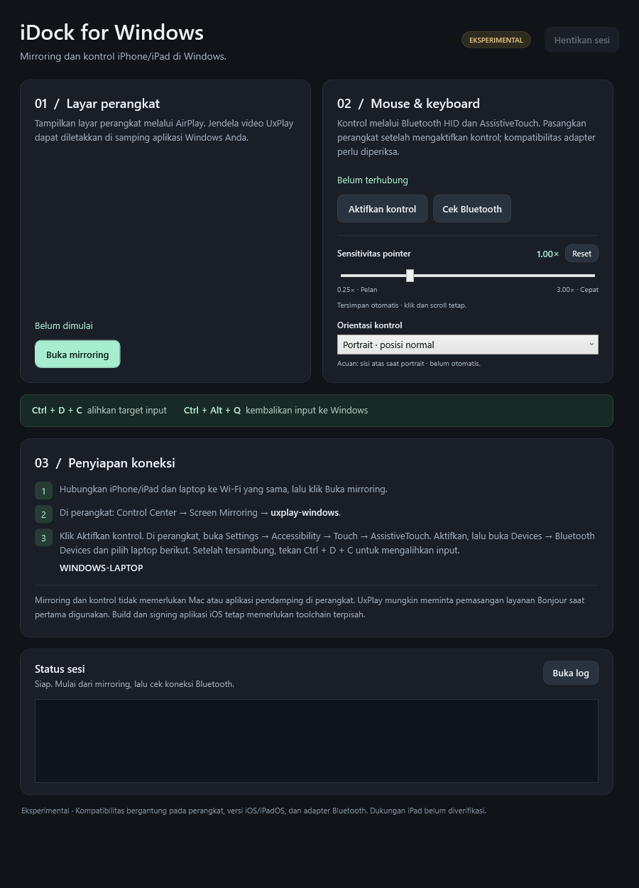

# iDock for Windows

Tampilkan layar iPhone atau iPad di Windows dan gunakan mouse serta keyboard laptop untuk berinteraksi dengan perangkat.

iDock menggabungkan **AirPlay melalui UxPlay** untuk tampilan layar dan **Bluetooth LE HID** untuk kontrol. Kedua koneksi bekerja secara terpisah. Aplikasi ini bukan fitur iPhone Mirroring resmi Apple.

**Versi 0.5.0 masih eksperimental.** Dokumentasi ini ditujukan untuk pengguna yang ingin membangun dan mencoba aplikasi, bukan pernyataan bahwa aplikasi sudah stabil untuk penggunaan produksi.



*Pratinjau antarmuka; bukan bukti koneksi perangkat aktif.*

## Status kompatibilitas

| Lingkungan | Status |
| --- | --- |
| Satu konfigurasi iPhone 11 dan Windows 11 | Mirroring dan kontrol dasar pernah digunakan. Pengujian ulang lengkap versi 0.5, koneksi berulang, dan sesi panjang masih diperlukan. |
| Model iPhone, versi iOS, dan adapter Bluetooth lainnya | Belum tersedia matriks kompatibilitas yang terverifikasi. |
| iPad dan iPadOS | Ditujukan sebagai perangkat yang dapat dicoba; belum diverifikasi pada perangkat nyata. |

Aplikasi tidak membatasi model tertentu, tetapi **tidak menjamin dukungan semua versi iOS/iPadOS**. Kontrol memerlukan adapter dan driver yang menyediakan BLE peripheral/GATT advertising; kemampuan menghubungkan headset Bluetooth saja tidak cukup.

## Fitur

- Mirroring di jendela terpisah melalui jaringan lokal.
- Pointer relatif, klik, drag, scroll, dan keyboard melalui Bluetooth HID.
- Sensitivitas pointer **0.25×–3.00×**, dengan penyimpanan otomatis.
- Koreksi arah **portrait/landscape manual**, tanpa memasangkan ulang perangkat.
- **Ctrl + D + C** untuk berpindah target input; **Ctrl + Alt + Q** untuk kembali ke Windows.
- Pemeriksaan Bluetooth, status sesi, dan log lokal.

Mirroring dan kontrol tidak memerlukan aplikasi pendamping di iPhone/iPad, Mac, jailbreak, atau Developer Mode. Ini **tidak berlaku untuk proses pengembangan iOS**: build, penandatanganan, instalasi aplikasi uji, dan debugging tetap memerlukan alur pengembangan yang sesuai. iDock bukan pengganti Xcode, simulator, atau debugger.

## Mulai mencoba

### 1. Siapkan Windows dan bangun aplikasi

Gunakan Windows x64 dengan sesi desktop, Git, PowerShell 5.1 atau 7, **.NET 10 SDK x64**, serta akses NuGet dan GitHub. Batas Windows yang diperiksa skrip adalah Windows 10 build 19041; Windows 11 direkomendasikan. Untuk menjalankan aplikasi, **.NET 10 Desktop Runtime x64** harus tersedia. Komputer yang hanya menjalankan paket tidak memerlukan SDK.

```powershell
git clone https://github.com/samuelraindrwn/iphone-dock-windows.git
Set-Location .\iphone-dock-windows
dotnet --list-sdks
dotnet --list-runtimes
.\scripts\build.ps1
.\scripts\test.ps1
```

Pastikan SDK `10.0.*` dan runtime `Microsoft.WindowsDesktop.App 10.0.*` tercantum. Petunjuk unduhan dan persiapan lengkap tersedia di [panduan instalasi](docs/INSTALL.md#kebutuhan).

Hasil build berada di **`dist\iDock\iDock.exe`**, bersama dependensi dan dokumentasinya. Skrip pengujian menjalankan **80 pemeriksaan launcher dan 115 pemeriksaan backend tanpa perangkat keras**. Tes ini tidak mengaktifkan kontrol Bluetooth atau membuktikan perangkat sudah kompatibel.

Panduan ini menggunakan build dari source; tidak mengasumsikan tersedianya installer atau paket siap pakai di GitHub Releases.

### 2. Pasang seluruh paket ke lokasi tetap

Salin **seluruh folder `dist\iDock`** ke lokasi instalasi tetap yang dapat ditulis akun pengguna, lalu buka `iDock.exe` di lokasi tersebut. Jangan hanya menyalin EXE dan jangan menggunakan instalasi aktif sebagai output build.

Bonjour Service dan Windows Firewall dapat menyimpan path absolut. Tentukan lokasi sebelum menjalankan mirroring pertama kali. Untuk instalasi lama atau perubahan lokasi, ikuti [panduan migrasi](docs/INSTALL.md#migrasi-nama-aplikasi).

### 3. Hubungkan perangkat

1. Hubungkan Windows dan perangkat ke jaringan lokal yang sama. Klik **Buka mirroring**; tinjau prompt Bonjour dan Firewall jika muncul.
2. Di perangkat, pilih **Control Center → Screen Mirroring → uxplay-windows**. Pastikan gambar tampil di Windows.
3. Aktifkan Bluetooth, lalu klik **Aktifkan kontrol**. Di aplikasi **Settings** perangkat, buka **Accessibility → Touch → AssistiveTouch**, aktifkan, lalu pilih **Devices → Bluetooth Devices** dan pasangkan nama laptop.
4. Setelah koneksi input tersedia, tekan dan tahan Ctrl serta D, tekan C, lalu lepaskan semua tombol. Periksa target input sebelum mencoba gerakan, klik, dan teks di aplikasi uji.
5. Tekan **Ctrl + Alt + Q** untuk kembali ke Windows sebelum mengubah sensitivitas, orientasi, atau menghentikan sesi.

Menu pemasangan ada di **Settings**, bukan pada tombol AssistiveTouch yang mengambang. Tulisan Bluetooth umum `Connected` belum membuktikan koneksi keyboard/mouse HID sudah tersedia. Lihat [cara pakai lengkap](docs/USAGE.md) atau [pemecahan masalah](docs/TROUBLESHOOTING.md).

## Batas penggunaan

Pointer tidak dipetakan langsung ke koordinat jendela video. Rotasi belum otomatis; sensitivitas mengatur jarak gerakan, bukan latensi. Batas 60 FPS pada receiver bukan jaminan 60 FPS aktual. Multi-touch, biometrik, konten terlindungi, dan kontrol tanpa keterlambatan tidak dijamin.

Gunakan data uji yang tidak sensitif saat mencoba aplikasi. Jika input tidak dapat dikembalikan atau target tidak jelas, hentikan pengujian. Pengujian perangkat nyata, termasuk hotkey saat koneksi bermasalah, masih menjadi bagian dari [kriteria kestabilan](docs/STABILITY-TESTS.md).

## Dokumentasi

- [Instalasi, persyaratan, build, dan upgrade](docs/INSTALL.md)
- [Penggunaan, pemasangan Bluetooth, hotkey, dan orientasi](docs/USAGE.md)
- [Pemecahan masalah dan pelaporan bug](docs/TROUBLESHOOTING.md)
- [Arsitektur, penyimpanan, dan batas implementasi](docs/ARCHITECTURE.md)
- [Checklist pengujian kestabilan](docs/STABILITY-TESTS.md)
- [Roadmap: kompatibilitas iOS/iPadOS, latensi, dan perbaikan bug](docs/ROADMAP.md)
- [Versi dan checksum komponen](COMPONENTS.json)
- [Lisensi pihak ketiga](THIRD_PARTY_NOTICES.md)

## Struktur repository

```text
source/iDock/           Launcher WPF .NET 10
source/blehid-patched/   Backend BLE HID beserta modifikasinya
source/upstream/        Referensi source upstream yang digunakan
scripts/               Build dan pengujian otomatis
docs/                  Dokumentasi publik
licenses/              Pemberitahuan lisensi upstream
dist/iDock/            Paket hasil build; tidak masuk Git
```

## Privasi dan lisensi

Log disimpan secara lokal dan tidak diunggah otomatis. Sebelum [melaporkan masalah](docs/TROUBLESHOOTING.md#mengirim-laporan-masalah), samarkan identitas perangkat, alamat Bluetooth, path pribadi, dan informasi sensitif. Jangan unggah folder `data`.

Sumber kode milik proyek iDock menggunakan [MIT](LICENSE). Backend Windows BLE HID mempertahankan MIT dan atribusi upstream. UxPlay beserta komponen pendukung mengikuti lisensinya masing-masing, termasuk GPLv3; lihat [pemberitahuan pihak ketiga](THIRD_PARTY_NOTICES.md).
