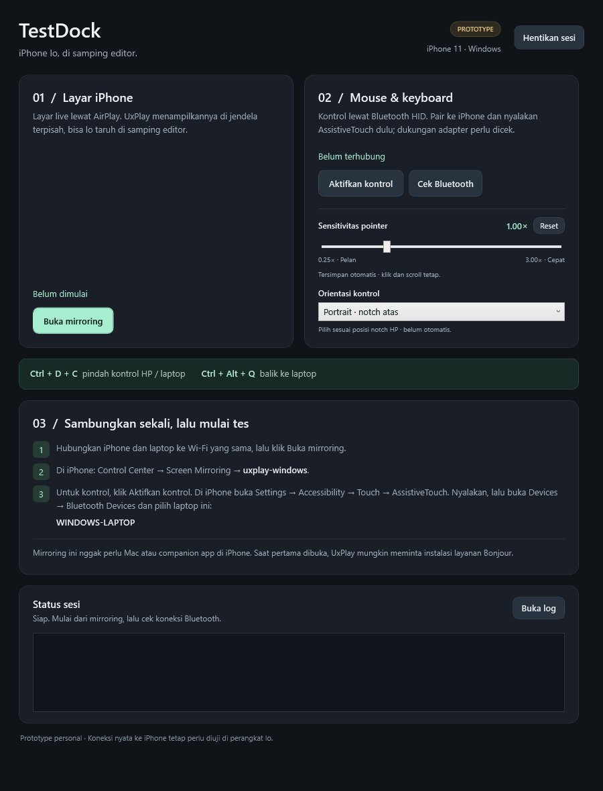

# TestDock — iPhone Dock for Windows

Tampilkan layar iPhone di Windows dan kendalikan pointer/keyboard dari laptop untuk mencoba aplikasi tanpa terus berpindah perangkat.

TestDock menggabungkan **AirPlay melalui UxPlay** untuk video dan **Bluetooth LE HID** untuk input. Ini prototype Windows x64, bukan fitur iPhone Mirroring resmi Apple. Mirroring dan kontrol dasar sudah dicoba pada satu setup iPhone 11; kompatibilitas semua adapter dan versi iOS belum dijamin.



*Preview antarmuka; bukan bukti koneksi iPhone aktif.*

## Fitur

- Layar iPhone di jendela terpisah, cocok diletakkan di samping editor.
- Pointer relatif, klik/drag, scroll, dan keyboard melalui Bluetooth HID.
- Slider sensitivitas **0.25×–3.00×**, diterapkan saat kontrol berjalan.
- Koreksi arah **portrait/landscape manual**, tanpa pairing ulang.
- **Ctrl + D + C** untuk berpindah target; **Ctrl + Alt + Q** untuk kembali ke laptop.
- Pemeriksaan Bluetooth, status sesi, dan log lokal.

Setup ini tidak memerlukan companion app di iPhone, Mac, jailbreak, atau Developer Mode. Namun, TestDock **tidak menggantikan build/signing iOS, Xcode, simulator, atau debugger**: aplikasi yang diuji harus sudah bisa dijalankan di iPhone.

## Mulai dari source

Diperlukan Windows x64 (Windows 11 direkomendasikan), Git, **.NET 10 SDK x64**, dan jaringan internet saat build pertama. Kontrol memerlukan adapter/driver Bluetooth yang mampu menjalankan **BLE peripheral/GATT advertising**; dukungan headset Bluetooth saja tidak cukup.

```powershell
git clone https://github.com/samuelraindrwn/iphone-dock-windows.git
cd iphone-dock-windows
.\scripts\build.ps1
.\scripts\test.ps1
```

Paket lengkap tersedia di `dist\TestDock`. Skrip membangun source TestDock/backend dan mengunduh UxPlay versi tetap dengan pemeriksaan SHA-256. Belum ada installer atau paket GitHub Release yang dijanjikan oleh panduan ini.

**Sebelum penggunaan pertama, salin seluruh folder paket ke lokasi instalasi tetap yang dapat ditulis**, lalu jalankan `TestDock.exe` di sana. Jangan menggunakan folder instalasi aktif sebagai output build. Bonjour Service dan Firewall dapat menyimpan path absolut; jangan memindahkan folder setelah setup tanpa memeriksa keduanya.

1. Hubungkan Windows dan iPhone ke jaringan lokal yang sama, lalu klik **Buka mirroring**. Tinjau prompt Bonjour/Firewall jika muncul.
2. Di iPhone: **Control Center → Screen Mirroring → uxplay-windows**.
3. Klik **Aktifkan kontrol**. Di Settings iPhone: **Accessibility → Touch → AssistiveTouch → Devices → Bluetooth Devices**, lalu pasangkan nama laptop. Aktifkan AssistiveTouch terlebih dahulu.
4. Tekan **Ctrl + D + C** untuk memilih iPhone. **Ctrl + Alt + Q** mengembalikan input ke Windows.
5. Kembali ke Windows sebelum mencoba slider sensitivitas atau mengubah orientasi kontrol.

Menu pairing ada di **Settings**, bukan menu AssistiveTouch yang mengambang. Status Bluetooth umum “Connected” juga belum membuktikan laporan input HID tersambung.

## Dokumentasi

- [Instalasi, kebutuhan, build, dan upgrade](docs/INSTALL.md)
- [Cara pakai, pairing, hotkey, sensitivitas, dan landscape](docs/USAGE.md)
- [Troubleshooting Bluetooth, video, delay, dan log](docs/TROUBLESHOOTING.md)
- [Arsitektur, penyimpanan, keselamatan input, dan batas pengujian](docs/ARCHITECTURE.md)
- [Versi dan checksum komponen](COMPONENTS.json)
- [Lisensi dan atribusi pihak ketiga](THIRD_PARTY_NOTICES.md)

Komputer yang hanya menjalankan paket membutuhkan **.NET 10 Desktop Runtime x64**, bukan SDK. Instalasi/build tidak otomatis mengaktifkan kontrol atau melakukan pairing.

## Struktur repository

```text
source/TestDock/          Launcher WPF .NET 10
source/blehid-patched/    Source lengkap backend dan modifikasi TestDock
source/upstream/          Referensi source upstream yang dipatok
scripts/                 Build paket dan pemeriksaan otomatis
docs/                    Panduan instalasi/penggunaan/diagnosis
licenses/                Pemberitahuan lisensi distribusi upstream
dist/TestDock/            Paket hasil build (tidak masuk Git)
```

## Verifikasi dan batasan

`scripts/test.ps1` menjalankan **51 pemeriksaan launcher** dan **79 pemeriksaan backend tanpa perangkat keras**. Pengujian ini tidak mengaktifkan advertising atau input hooks. Koneksi iPhone, pemetaan notch fisik, reconnect, dan latensi tetap memerlukan uji perangkat nyata.

Pointer bersifat relatif; ini bukan injeksi sentuhan langsung pada koordinat jendela video. Orientasi belum otomatis. Sensitivitas mengubah jarak gerak, bukan delay. Opsi 60 FPS adalah batas yang ditawarkan receiver, bukan jaminan frame rate aktual. Multi-touch, biometrik, konten terlindungi, dan kontrol bebas latensi tidak dijanjikan.

Data pairing/pengaturan, log, binary vendor, dan laporan pengujian tidak diunggah ke repo. Sebelum membuat issue, samarkan nama perangkat, alamat Bluetooth, path pribadi, dan isi layar iPhone pada lampiran.

## Lisensi

Source milik project TestDock menggunakan [MIT](LICENSE). Backend Windows BLE HID mempertahankan MIT dan atribusi upstream. UxPlay dan komponen pendukung mengikuti lisensinya masing-masing, termasuk GPLv3; lihat [THIRD_PARTY_NOTICES.md](THIRD_PARTY_NOTICES.md).
